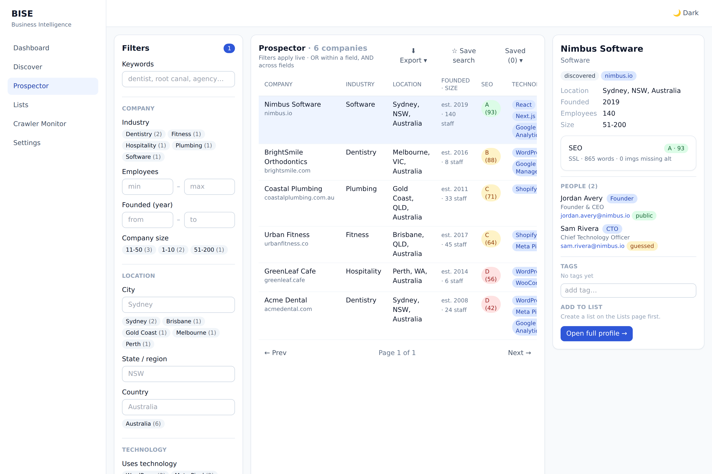

# Business Intelligence Search Engine (BISE)

A local-first, open-source B2B prospecting engine. Discover businesses from
public data, enrich them from their own websites, and search them with
Sales-Navigator-style filters — then organize, tag, and export your prospects.

**Hard constraints, upheld throughout:** no LinkedIn (no scraping, no cookies),
no paid APIs, no AI APIs. Free/open-source libraries only. Runs entirely on your
machine.



## What it does

- **Discover** businesses by category + location from **OpenStreetMap**
  (Nominatim + Overpass) — free, no key.
- **Enrich** each company from its *own public website* (robots-aware crawler):
  detected technologies, marketing tools, SEO score/grade, firmographics, and
  **people** (founder / CEO / CTO …) from public team pages.
- **Prospect** with a 3-pane, Sales-Navigator-style UI: grouped filters
  (industry, location, company size, founded year, technology, SEO, hiring,
  **role**), live result counts, saved searches, and facets.
- **Organize**: named lists (bookmarks), company tags, saved searches.
- **Export** any result set or list to **CSV / Excel / JSON**.
- **Scale the work**: a DB-backed enrichment queue + worker enriches whole lists
  in the background.
- **Run it as a SaaS** (optional): workspaces + API keys, per-key rate limiting,
  and TTL response caching — all off-the-shelf and swappable for Redis later.

### Ethical people & emails

People are extracted only from what a company publishes about itself. Emails are
either **published** on the site or **guessed** from an email pattern observed on
that same domain — and the guessed ones are always labelled as unverified. No
LinkedIn, no purchased datasets.

## Architecture

Clean Architecture, dependencies point inward; every external concern sits
behind a port with an in-memory/portable default and a shared contract test, so
the backend (SQLite→PostgreSQL), search (SQL→OpenSearch), rate limiter and cache
(in-memory→Redis) can all be swapped without touching business logic.

```
src/bise/
  domain/          # pure business rules (entities, value objects, services) — framework-free
  application/     # use cases + ports (interfaces) + DTOs
  infrastructure/  # concrete adapters: DB, search, crawling, analyzers, cache, rate limit, export
  crawlers/        # worker-side crawler orchestrators
  presentation/    # FastAPI app, routers, middleware, background workers
  shared/          # cross-cutting helpers (pagination …)
config/            # settings, logging, composition root (the only place that wires concretes)
frontend/          # React + Vite + TypeScript + Tailwind SPA
tests/             # unit · integration · contract · e2e
```

The dependency rule and "domain is framework-free" are **enforced in CI** by
import-linter; ports are proven swap-safe by shared contract test suites.

## Tech stack

Python 3.11 · FastAPI · SQLAlchemy 2.0 · Alembic (12 reversible migrations) ·
pydantic v2 · structlog · httpx · BeautifulSoup4 + lxml · openpyxl ·
React 18 · Vite · TypeScript (strict) · Tailwind · TanStack Query/Table.

## Quick start

Backend:

```bash
make install        # create .venv, install package + dev tooling
make migrate        # apply Alembic migrations (creates ./bise.db by default)
python scripts/seed_demo.py   # optional: demo companies, people, firmographics
make serve          # uvicorn on http://127.0.0.1:8000  (docs at /docs)
```

Frontend (in `frontend/`):

```bash
npm install
npm run dev         # http://127.0.0.1:5173  (proxies /api to the backend)
```

Background enrichment worker (optional, separate process, same DB):

```bash
python scripts/enrichment_worker.py        # drains the queue, then polls
```

Full Windows + macOS/Linux steps: [`LOCAL_SETUP.md`](./LOCAL_SETUP.md).

## Configuration

Everything is 12-factor via `BISE_*` env vars (or a `.env` file). Highlights:

| Variable | Default | Purpose |
|---|---|---|
| `BISE_DATABASE_URL` | `sqlite:///./bise.db` | SQLite (dev) / PostgreSQL (prod) — one swap seam |
| `BISE_AUTH_ENABLED` | `false` | Require an API key (`Authorization: Bearer …`) when true |
| `BISE_RATE_LIMIT_ENABLED` / `_PER_MINUTE` / `_BURST` | `true` / `300` / `300` | Per-key/IP token bucket |
| `BISE_CACHE_ENABLED` / `_TTL_SECONDS` | `true` / `30` | Search response cache |

Auth is **off by default**, so local use needs no setup; a deployer flips it on
and mints keys from **Settings → API keys**.

## Quality gates (what CI runs)

```bash
make check   # ruff · mypy --strict · import-linter · pytest
```

- **293** tests (unit · integration · port-contract · e2e), all offline (no live
  network — external sources are faked/fixtured).
- `mypy --strict` across `src` + `config`; ruff lint + format.
- import-linter enforces the Clean Architecture dependency rule.
- **90%** coverage gate on `bise.domain` + `bise.application` (currently ~97%).
- Frontend job: `tsc --noEmit` + `vite build`.

## Feature map

| Area | Highlights |
|---|---|
| Discovery | OpenStreetMap category+location → companies |
| Firmographics | industry, location, company size, founded year, employees, contact |
| Search | OR-within/AND-across filters, `between` ranges, multi-select, keyword over on-site text, facets |
| Prospector UI | grouped filter rail, live counts, saved searches, 3-pane layout |
| Workspace | saved searches, lists/bookmarks, company tags (tenant-scoped) |
| Export | CSV / Excel (.xlsx) / JSON of results or list members |
| Enrichment queue | DB-backed jobs + worker, bulk "enrich all", live monitor |
| People & roles | founder/CEO/CTO extraction, public vs guessed emails, role filter |
| SaaS layer | workspaces + API keys (opt-in auth), rate limiting, response caching |

## License

Open-source components only; see individual dependencies for their licenses.
