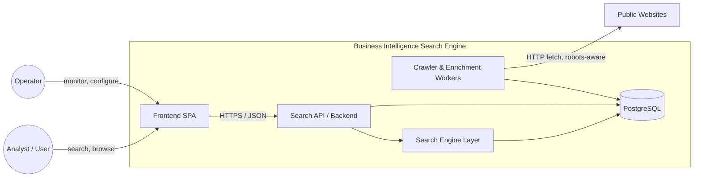
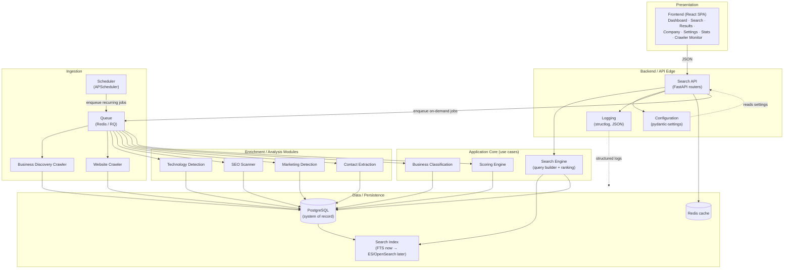
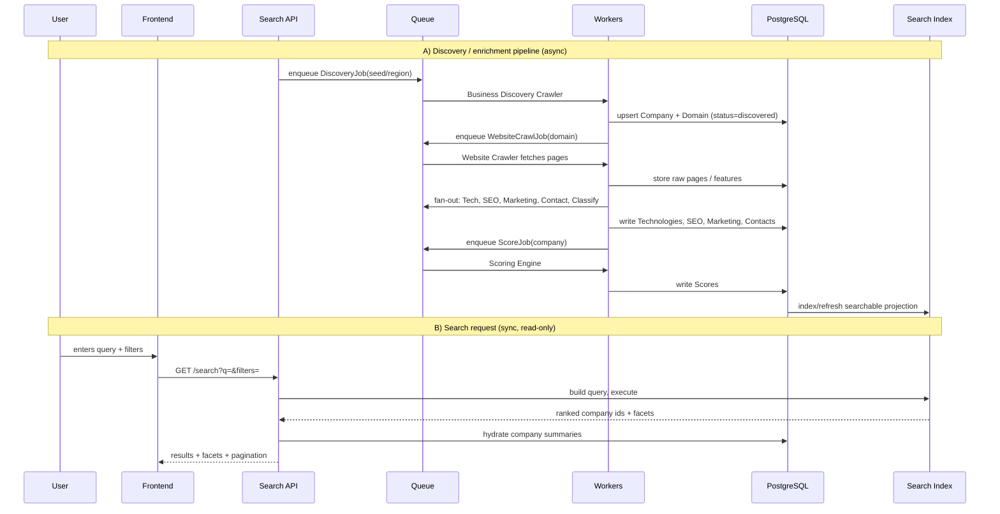

# 1. High-Level System Architecture

The platform is a set of **independently deployable, independently testable modules**
that communicate through explicit contracts: HTTP for the UI↔API edge, a message
**Queue** for all long-running work, and the **Database** as the shared system of record.

The golden rule of the diagram: **nothing crawls or scores synchronously inside an HTTP
request.** The API only reads the database and enqueues jobs. All heavy work happens in
workers driven by the Queue and Scheduler.

## System Context (C4 Level 1)

## Component Diagram (C4 Level 2 — the required components)

## Data & Control Flow (end-to-end)

## Component Responsibilities (one line each)

| Component | Single Responsibility |
|-----------|----------------------|
| **Frontend** | Render UI; call the Search API; never talk to the DB or queue directly. |
| **Backend / Search API** | Validate input, orchestrate use cases, read DB/index, enqueue jobs. |
| **Search Engine** | Translate filters → index query, rank, paginate, produce facets. |
| **Database** | Durable system of record; normalized truth for every entity. |
| **Business Discovery Crawler** | Find new businesses/domains from open sources → create Company/Domain rows. |
| **Website Crawler** | Fetch a domain's pages politely; produce raw HTML/features for analyzers. |
| **Technology Detection** | Fingerprint the stack (CMS, frameworks, analytics) from crawled pages. |
| **SEO Scanner** | Extract meta/robots/sitemap/structured-data signals and grade them. |
| **Business Classification** | Assign industry/category/size from signals (rule-based, no AI API). |
| **Marketing Detection** | Detect pixels, tag managers, ad/CRM/email tools. |
| **Contact Extraction** | Extract emails, phones, socials, addresses from pages. |
| **Queue** | Decouple request from work; buffer, retry, backpressure. |
| **Scheduler** | Trigger recurring/periodic jobs (recrawl, refresh, cleanup). |
| **Logging** | Structured, correlated logs across API and workers. |
| **Configuration** | One typed, validated source of settings per environment. |

## Why this shape scales

- **Queue in the middle** means workers scale horizontally without the API knowing.
- **DB as system of record + separate Search Index** lets us swap FTS→OpenSearch by
  changing one adapter (see doc 5) — business logic never learns which engine answered.
- **Every enrichment module is a queue consumer**, so tech/SEO/marketing/contact each
  scale, fail, retry, and deploy independently.
- **No synchronous crawling** keeps p99 API latency bounded regardless of crawl load.
