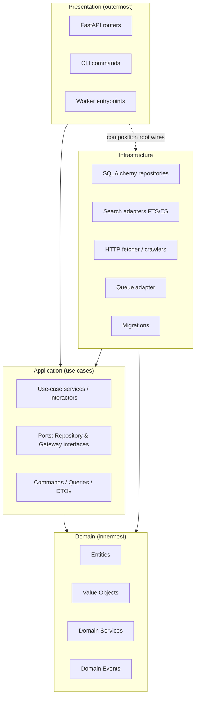
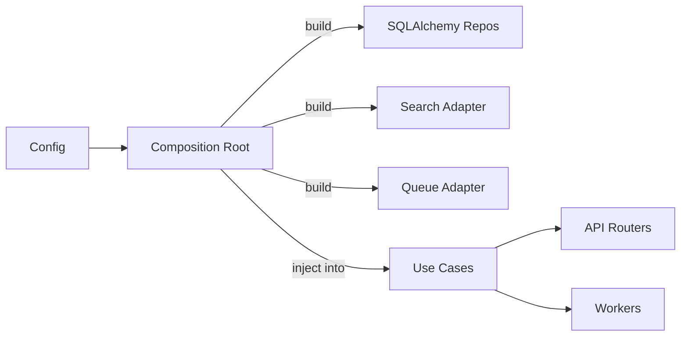

# 2. Clean Architecture — The Four Layers

The **Dependency Rule** governs everything:

> Source-code dependencies point **only inward**. Inner layers know nothing about outer
> layers. The Domain does not import FastAPI, SQLAlchemy, httpx, or Redis. Ever.

Note the arrows: **Infrastructure depends on Application/Domain** (it implements their
interfaces), **not** the other way around. This is Dependency Inversion in the large.

---

## Domain Layer (innermost) — *"What the business is"*

**Responsibility:** Encode the rules and vocabulary of business intelligence with zero
knowledge of how anything is stored, transported, or displayed.

Contains:
- **Entities** — objects with identity and lifecycle: `Company`, `Domain`, `Technology`,
  `Contact`, `CrawlJob`, `Score`.
- **Value Objects** — immutable, equality-by-value: `Url`, `EmailAddress`, `PhoneNumber`,
  `IndustryCode`, `SeoGrade`, `TechConfidence`.
- **Domain Services** — logic that spans entities and has no natural home: e.g.
  `ScoringPolicy`, `ClassificationRules`.
- **Domain Events** — `CompanyDiscovered`, `WebsiteCrawled`, `TechnologyDetected`.

Rules:
- Pure Python. No imports of frameworks, ORMs, or I/O libraries.
- Invariants live here (e.g. "a Company must have at least one Domain to be searchable").
- 100% unit-testable with no mocks and no database.

---

## Application Layer — *"What the system does"*

**Responsibility:** Orchestrate domain objects to fulfill a use case. Defines the
**Ports** (interfaces) that the outer world must satisfy. This is where the Repository
Pattern's *interfaces* live.

Contains:
- **Use cases / interactors** — one class per operation: `SearchCompanies`,
  `DiscoverBusinesses`, `EnrichCompany`, `RunSeoScan`, `RescoreCompany`.
- **Ports (interfaces)**:
  - Repository ports: `CompanyRepository`, `DomainRepository`, `TechnologyRepository`,
    `CrawlJobRepository`, `ScoreRepository`.
  - Gateway ports: `SearchIndexPort`, `PageFetcherPort`, `QueuePort`, `ClockPort`.
- **DTOs / Commands / Queries** — plain data crossing the boundary
  (`SearchQuery`, `CompanySummaryDTO`).
- **Unit of Work** — transaction boundary abstraction.

Rules:
- Depends only on the Domain.
- Knows nothing about FastAPI, SQL, Redis, or JSON.
- Tested by injecting **in-memory fakes** of the ports — fast, deterministic.

---

## Infrastructure Layer — *"How it's actually done"*

**Responsibility:** Provide concrete implementations of Application ports using real
technology. This is the only layer allowed to import SQLAlchemy, httpx, Redis, etc.

Contains:
- **Repositories** — SQLAlchemy implementations of the repository ports.
- **Search adapters** — `PostgresFtsSearchAdapter` (v1), `OpenSearchAdapter` (later),
  both implementing `SearchIndexPort`.
- **Crawling** — `HttpxPageFetcher`, `PlaywrightPageFetcher` implementing `PageFetcherPort`.
- **Queue** — `RqQueueAdapter` implementing `QueuePort`.
- **Persistence models & migrations** — SQLAlchemy tables, Alembic scripts.
- **External data parsers** — Wappalyzer rule loader, robots.txt parser, sitemap parser.

Rules:
- Implements interfaces it does **not** define (they live in Application).
- Swappable: switching FTS→OpenSearch changes only this layer + one config line.
- Tested with integration tests against a real (containerized) Postgres/Redis.

---

## Presentation Layer (outermost) — *"How it's exposed"*

**Responsibility:** Adapt the outside world to use cases and back. Three entrypoints
share the same Application core:

- **HTTP API** — FastAPI routers; convert JSON ⇄ DTOs, handle auth, status codes.
- **Workers** — queue consumers that invoke enrichment/crawl use cases.
- **CLI** — operational commands (seed discovery, run a migration, reindex).

Rules:
- Thin. No business logic — only mapping, validation framing, and transport concerns.
- Depends on Application (calls use cases) and on the **composition root** for wiring.

---

## Composition Root (the wiring)

A single place (`main.py` / a container module) constructs concrete Infrastructure
objects and injects them into use cases. This is the **only** place that knows every
concrete class. Everything else depends on abstractions.

## Why this matters for a project that must reach millions of businesses

- The **search backend swap** (Postgres FTS → OpenSearch) touches Infrastructure only.
- The **queue swap** (RQ → Celery/Kafka) touches Infrastructure only.
- New enrichment modules are new use cases + ports — no change to existing ones (OCP).
- The domain rules for scoring/classification are unit-tested in milliseconds, so they
  can evolve safely as the dataset grows.
