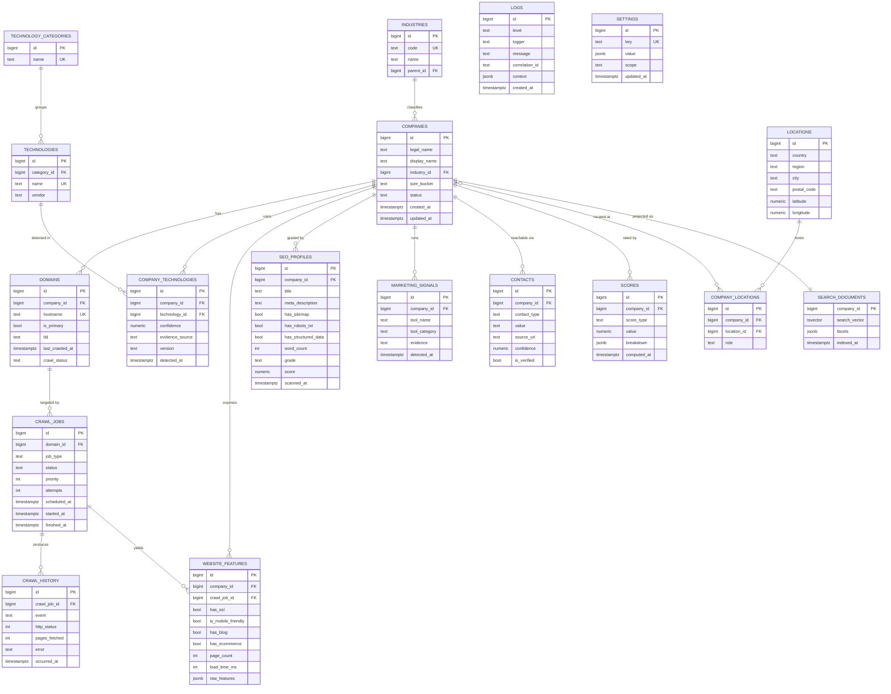

# 4. Database Design

**Engine:** PostgreSQL 15. **Normal form target:** 3NF everywhere; controlled
denormalization only in the dedicated `search_documents` projection (doc 5).

Design principles:
- **Company** is the aggregate root; a **Domain** belongs to exactly one company.
- Reference data (technologies, industries) is normalized into lookup tables; per-company
  facts are join rows carrying evidence (confidence, source, timestamps).
- Every table has surrogate `id` (BIGINT/UUID), `created_at`, `updated_at`.
- Soft, append-only history for anything auditable (`crawl_history`, `logs`).

## Entity–Relationship Diagram (core)

## Table catalog & responsibilities

| Table | Grain (one row per…) | Key relationships |
|-------|----------------------|-------------------|
| **companies** | business entity (aggregate root) | → industries (M:1); parent of everything |
| **domains** | website hostname | company_id → companies (M:1); target of crawl_jobs |
| **technology_categories** | tech category (Analytics, CMS…) | parent of technologies |
| **technologies** | canonical technology (lookup) | category_id → technology_categories |
| **company_technologies** | *detected* tech on a company (join + evidence) | company_id, technology_id |
| **website_features** | crawl-derived feature snapshot | company_id, crawl_job_id |
| **seo_profiles** | SEO scan result for a company | company_id |
| **marketing_signals** | one detected marketing tool | company_id |
| **contacts** | one contact datum (email/phone/social/address) | company_id |
| **industries** | industry taxonomy node (self-referencing tree) | parent_id → industries |
| **locations** | canonical place (dedup'd) | referenced via company_locations |
| **company_locations** | company↔location link with a role (HQ, branch) | company_id, location_id |
| **scores** | one score of a given type for a company | company_id |
| **crawl_jobs** | a unit of crawl/enrichment work | domain_id → domains |
| **crawl_history** | one lifecycle event of a job (append-only) | crawl_job_id |
| **logs** | one structured log line (optional DB sink) | correlation_id joins to jobs |
| **search_documents** | denormalized searchable projection of a company | company_id → companies (1:1) |
| **settings** | one configuration key/value | scope-namespaced |

## Normalization decisions (the "why")

- **`technologies` vs `company_technologies`** — technologies are shared reference data;
  the *fact that Company X uses Tech Y* is a separate join row carrying evidence
  (confidence, version, source). This avoids duplicating tech names across millions of
  companies and lets facets like "companies using Shopify" be a single indexed join.
- **`locations` de-duplicated + `company_locations` link** — a city is stored once; many
  companies point at it. Supports geo-faceting and future multi-location businesses (M:N)
  without row duplication.
- **`industries` self-referencing** — supports a hierarchy (e.g. Retail → Apparel) so a
  search for a parent category can include children.
- **`marketing_signals` / `contacts` as tall tables** — a company can have 0..N of each;
  modeling them as rows (not JSON columns) keeps them queryable and indexable.
- **`website_features.raw_features` JSONB** — the *graded/known* features are columns; the
  long tail of raw signals is JSONB so we capture everything without schema churn.
- **`crawl_jobs` vs `crawl_history`** — the job is mutable current-state; history is
  append-only audit. Never overwrite history → full observability of the pipeline.
- **`scores` with `breakdown` JSONB** — the numeric value is queryable; the explanation of
  how it was computed travels with it for transparency and debugging.
- **`search_documents` is the ONLY denormalized table** — a deliberate read-model that the
  pipeline rebuilds from normalized truth. The write side stays 3NF; the read side stays fast.

## Indexing (initial)

| Index | Table.column(s) | Purpose |
|-------|-----------------|---------|
| unique | `domains.hostname` | one row per hostname |
| btree | `domains.company_id` | join back to company |
| btree | `company_technologies (technology_id, company_id)` | "who uses tech X" facet |
| btree | `companies.industry_id`, `companies.size_bucket`, `companies.status` | filter facets |
| GIN | `search_documents.search_vector` | full-text search |
| GIN | `website_features.raw_features` / `scores.breakdown` | JSONB containment queries |
| btree | `crawl_jobs (status, priority, scheduled_at)` | queue picking / monitor |
| btree | `contacts (company_id, contact_type)` | contact lookup |
| btree | `logs (correlation_id, created_at)` | trace a pipeline run |

## Relationship summary (cardinalities)

- Company **1—N** Domain
- Company **1—N** {WebsiteFeatures, SeoProfile(s), MarketingSignal, Contact, Score}
- Company **N—1** Industry
- Company **N—M** Location (via CompanyLocation)
- Company **N—M** Technology (via CompanyTechnology, with evidence)
- Domain **1—N** CrawlJob **1—N** CrawlHistory
- Company **1—1** SearchDocument (read projection)

## Migrations & scale

- All schema changes go through **Alembic**; no manual DDL.
- Scale levers stay open: `company_technologies`, `crawl_history`, and `logs` are the
  high-volume tables → candidates for **partitioning** (by time / hash) and, at extreme
  scale, distribution via **Citus** — none of which changes the domain model.
