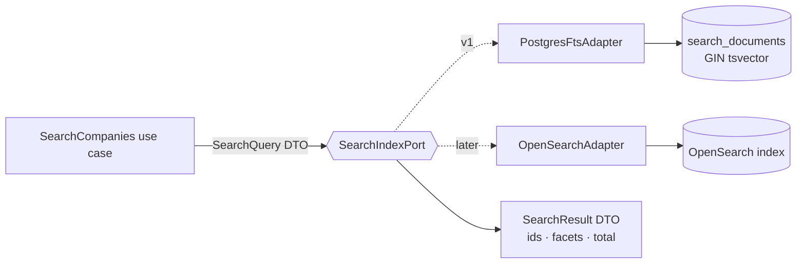
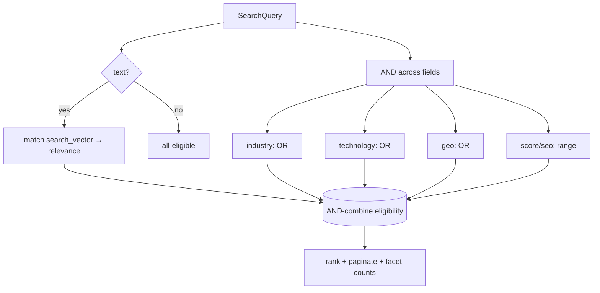
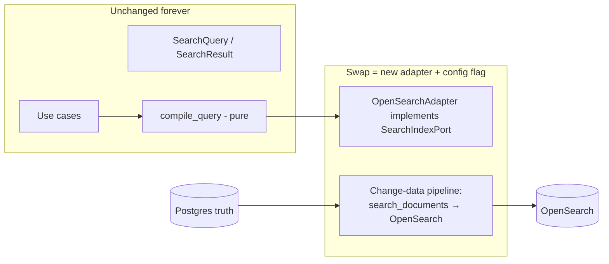

# 5. Search Engine Design

The single most important architectural bet: **search is a Port, not a database feature.**
Business logic asks a `SearchIndexPort` a question and gets ranked results. Whether the
answer comes from Postgres full-text search (v1) or OpenSearch (scale) is invisible above
the Infrastructure layer.



## The query model (technology-neutral)

The use case builds a `SearchQuery` object — never a SQL string, never an ES DSL:

```
SearchQuery:
  text: str | None                # free text ("dentist", "shopify agency")
  filters: list[Filter]           # structured constraints (see below)
  facets: list[str]               # fields to aggregate for the sidebar
  sort: SortSpec                   # relevance | score | recency | name
  page: int, page_size: int
```

A `Filter` is a small value object: `Filter(field, operator, value)` where `field` is a
whitelisted searchable attribute (`industry`, `technology`, `country`, `seo_grade`,
`has_ecommerce`, `size_bucket`, `score.opportunity`, …) and `operator` ∈
`{eq, in, gte, lte, range, exists}`. This closed vocabulary is what makes both adapters
implementable and keeps injection impossible.

## How filters combine

- **Within one field, multiple values = OR** (`technology in [Shopify, Klaviyo]`).
- **Across different fields = AND** (`industry=Retail AND country=US AND seo_grade>=B`).
- **Free text** contributes to **relevance ranking** and acts as an implicit AND filter
  (must match the text) unless empty.
- **Numeric/score filters** use range operators and never affect text relevance, only
  eligibility.



This composition logic lives in the **Application layer** as a pure function
(`compile_query(SearchQuery) -> AdapterAgnosticPlan`). The adapter then renders the plan
into `tsquery`/SQL or ES DSL. Because composition is pure, it is unit-tested without any
database.

## How indexes are created (v1: Postgres)

- The pipeline maintains `search_documents`, a **1:1 read projection** of each company:
  - `search_vector tsvector` — weighted concatenation:
    `setweight(display_name, 'A') || setweight(industry, 'B') || setweight(technologies, 'C') || setweight(description/keywords, 'D')`.
  - `facets jsonb` — precomputed filterable attributes (industry, country, tech list,
    seo_grade, size_bucket, scores) for fast faceting.
- **GIN index** on `search_vector` powers full-text; **`pg_trgm`** GIN supports fuzzy
  name matching (typos, partial names).
- The projection is (re)built by a `RebuildSearchDocument` step whenever an enrichment or
  score changes a company — so writes stay normalized while reads stay one lookup away.
- Facet counts come from indexed aggregations over `search_documents.facets` (and, for
  high-cardinality facets like technology, from the `company_technologies` join).

## Ranking

Default relevance = `ts_rank_cd(search_vector, query)` blended with a normalized
**business score** (from the `scores` table) so that, among equally-textually-relevant
companies, higher-quality/opportunity ones surface first. The blend weights live in
**config**, not code, and the ranking function is an isolated, testable domain service.

## Future Elasticsearch / OpenSearch integration — without touching business logic

Because everything above the adapter speaks `SearchQuery`/`SearchResult`:



Migration steps (all confined to Infrastructure + config):
1. Implement `OpenSearchAdapter(SearchIndexPort)` that renders the same `compile_query`
   plan into OpenSearch query DSL.
2. Stand up an **indexer** that streams `search_documents` (or CDC from Postgres) into an
   OpenSearch index with an equivalent mapping and analyzers.
3. Make both adapters pass the **same `SearchIndexPort` contract test suite** — this
   guarantees identical behavior before the switch.
4. Flip `SEARCH_BACKEND=opensearch` in config; the composition root injects the new
   adapter. **Zero changes** to use cases, DTOs, API, or frontend.
5. Optionally run **dual-read/shadow** mode: query both, compare results, then cut over.

### Why not start on OpenSearch?

For localhost/v1, Postgres FTS needs **no extra infrastructure**, is transactional with
our source of truth, and comfortably serves early datasets. The port guarantees we can
graduate to OpenSearch precisely when scale (index size, aggregation load, relevance
tuning, or multi-node search) demands it — and not a day sooner. That is the definition of
"designed for scale without paying for it early."
