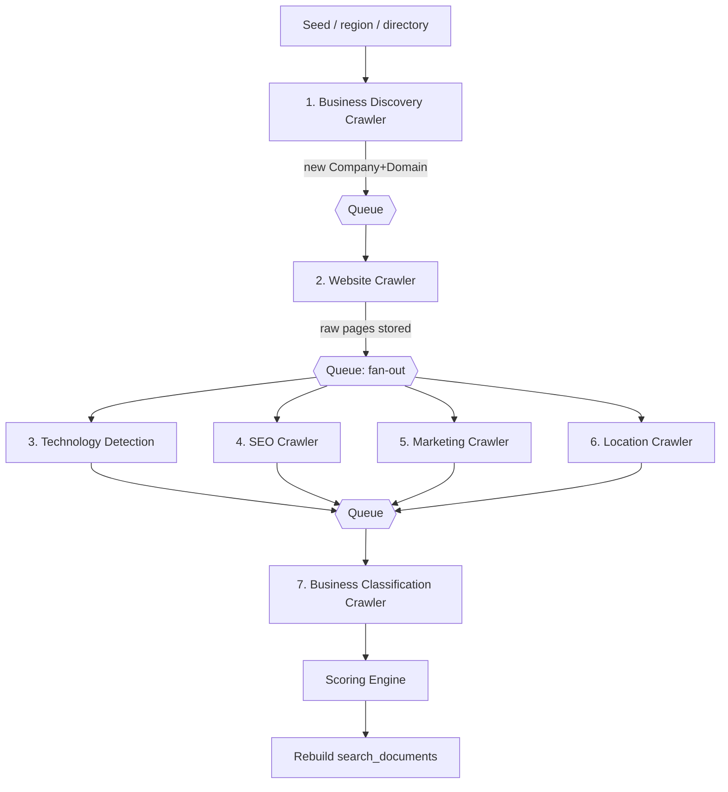

# 6. Crawler Architecture

Seven **single-responsibility** crawlers, each a queue consumer. They never call each
other directly — they **fan out via the Queue** by emitting the next job. This makes each
crawler independently scalable, retryable, deployable, and testable, and keeps the pipeline
observable through `crawl_jobs` / `crawl_history`.

All crawlers share a common base contract (a small abstract class in `crawlers/`):

```
BaseCrawler:
  handle(job: CrawlJob) -> CrawlResult      # idempotent, side-effect via repositories
  - reads input from job payload
  - uses PageFetcherPort (never raw httpx) for network
  - writes domain facts via repositories (never raw SQL)
  - records CrawlHistory events
  - emits follow-up jobs via QueuePort
```

Every crawler is **polite by construction**: robots.txt honored, `crawl-delay`/rate
limits enforced, per-host concurrency capped, user-agent identified, timeouts + retries
with backoff, and no fetching outside allowed domains.

## Pipeline & fan-out



## The seven crawlers

### 1. Business Discovery Crawler
- **Responsibility:** Find businesses/domains from **open, non-LinkedIn** sources
  (open business registries, OpenStreetMap/Overpass, open web directories, sitemaps of
  aggregators, seed lists). Produce `companies` + `domains` rows in `status=discovered`.
- **Input:** a seed spec (region, category, source id).
- **Output:** new Company/Domain rows; enqueues `WebsiteCrawlJob` per new domain.
- **Must not:** fetch full sites (that's the Website Crawler's job) or classify.
- **Testable via:** fake source fixtures → assert emitted companies (no network).

### 2. Website Crawler
- **Responsibility:** Politely fetch a domain's key pages (home, about, contact, sitemap-
  discovered pages up to a depth/limit). Store raw HTML + a `website_features` snapshot.
- **Input:** a `domain_id`.
- **Output:** raw page store + `website_features`; fans out Tech/SEO/Marketing/Location.
- **Must not:** interpret the stack or grade SEO — it only fetches and captures.
- **Testable via:** recorded HTTP fixtures (VCR-style) → deterministic feature extraction.

### 3. Technology Detection Crawler
- **Responsibility:** Fingerprint the stack (CMS, frameworks, e-commerce, analytics,
  servers) from crawled HTML/headers/scripts using **open Wappalyzer rule sets**.
- **Output:** `company_technologies` rows with confidence, version, evidence source.
- **Must not:** re-fetch pages — it consumes what the Website Crawler stored.
- **Testable via:** HTML fixtures + rule set → assert detected technologies + confidence.

### 4. SEO Crawler / Scanner
- **Responsibility:** Extract and grade SEO signals: title/meta, headings, robots.txt,
  sitemap.xml, canonical tags, structured data (JSON-LD), word count, mobile hints.
- **Output:** `seo_profiles` row with a grade + numeric score + evidence.
- **Testable via:** page fixtures → assert deterministic grade for known inputs.

### 5. Marketing Detection Crawler
- **Responsibility:** Detect marketing/adtech: tag managers, tracking pixels, ad tags,
  email/CRM tools, chat widgets — from scripts and network hints in stored pages.
- **Output:** `marketing_signals` rows (tool_name, category, evidence).
- **Testable via:** script-snippet fixtures → assert detected tools.

### 6. Location Crawler
- **Responsibility:** Resolve business location(s) from page content (addresses,
  structured data, `tel:`/`geo` hints) using **open geocoding** (e.g. Nominatim/OSM).
  Deduplicate into canonical `locations` and link via `company_locations`.
- **Output:** `locations` + `company_locations` rows.
- **Must not:** use paid geocoders. Rate-limit the open geocoder per its policy.
- **Testable via:** address fixtures + fake geocoder → assert canonicalized location.

### 7. Business Classification Crawler
- **Responsibility:** Assign industry/category and size bucket using **deterministic
  rules** over accumulated signals (keywords, detected tech, page structure) — **no AI
  API**. Maps into the `industries` taxonomy.
- **Input:** a company that has completed enrichment.
- **Output:** sets `companies.industry_id`, `companies.size_bucket`; triggers scoring.
- **Testable via:** signal-vector fixtures → assert classification, so rules can evolve safely.

## Cross-cutting crawler concerns

| Concern | Design |
|---------|--------|
| **Politeness** | robots.txt + crawl-delay in `infrastructure/crawling/robots.py`, per-host token bucket. |
| **Idempotency** | Jobs keyed by (type, target, run) → safe re-runs; upserts not blind inserts. |
| **Retries** | Queue-level retry with exponential backoff; permanent failures recorded in `crawl_history`. |
| **Backpressure** | Per-crawler queues with concurrency caps; discovery can't starve enrichment. |
| **Observability** | Every step writes `crawl_history`; the Crawler Monitor page reads it live. |
| **Fetcher abstraction** | `PageFetcherPort` (httpx for static, Playwright for JS) — crawlers never import a client. |
| **Scale path** | Each crawler = a worker pool; scale the busy one independently, or move its queue to Kafka. |

**Design payoff:** because fetching (`PageFetcherPort`), parsing (`analyzers/`), and
persistence (repositories) are all behind interfaces, every crawler's *logic* is pure and
runs in unit tests with fixtures — no live internet required in CI.
