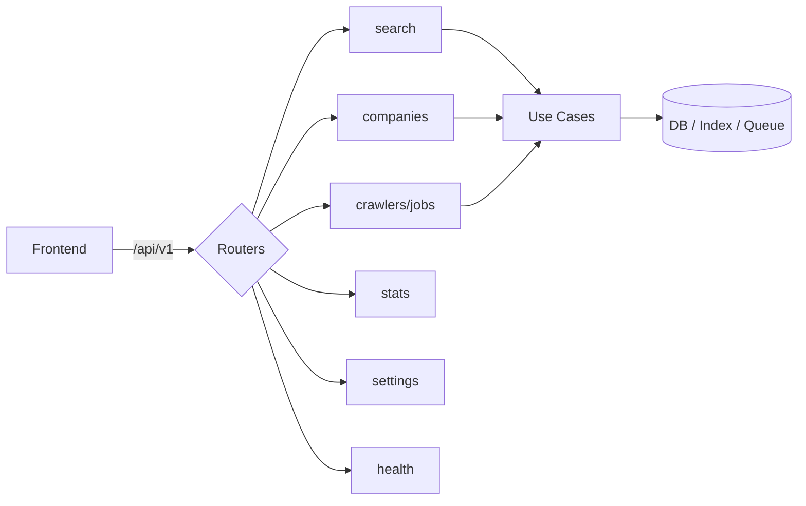

# 7. API Architecture (Design Only — No Implementation)

**Style:** REST over HTTP/JSON, versioned under `/api/v1`. FastAPI generates the OpenAPI
spec automatically, which becomes the contract the typed frontend client is generated from.

**Cross-cutting conventions (all endpoints):**
- **Base path:** `/api/v1`
- **Auth (future):** bearer token; v1 localhost may run open behind a feature flag.
- **Errors:** RFC 7807-style problem object: `{ "type", "title", "status", "detail", "correlation_id" }`.
- **Pagination:** `?page=&page_size=`; responses include `{ items, page, page_size, total }`.
- **Correlation:** every request carries/returns `X-Correlation-Id` (ties to logs & jobs).
- **Read vs write:** GETs read DB/index; POSTs that trigger work **enqueue jobs** and
  return `202 Accepted` with a job handle — never block on crawling.



## Endpoint catalog (future surface)

### Search
| Method | Path | Purpose |
|--------|------|---------|
| GET | `/api/v1/search` | Full search with text, filters, facets, sort, pagination |
| GET | `/api/v1/search/suggest` | Type-ahead suggestions (names, technologies) |
| GET | `/api/v1/search/facets` | Available facet fields + counts for current filter set |

**`GET /search` request (query params):**
```
q=shopify agency
filter=industry:Retail
filter=technology:Shopify,Klaviyo
filter=country:US
filter=seo_grade:gte:B
sort=relevance
page=1&page_size=20
facets=industry,technology,country,seo_grade
```
**Response:**
```json
{
  "items": [
    { "company_id": 123, "display_name": "Acme Co",
      "domain": "acme.com", "industry": "Retail",
      "country": "US", "technologies": ["Shopify","Klaviyo"],
      "seo_grade": "A", "scores": { "opportunity": 0.82 } }
  ],
  "facets": {
    "industry": [{"value":"Retail","count":142}],
    "technology": [{"value":"Shopify","count":98}]
  },
  "page": 1, "page_size": 20, "total": 142
}
```

### Companies
| Method | Path | Purpose |
|--------|------|---------|
| GET | `/api/v1/companies/{id}` | Full company detail (all enrichment) |
| GET | `/api/v1/companies/{id}/technologies` | Detected tech + confidence/evidence |
| GET | `/api/v1/companies/{id}/seo` | SEO profile |
| GET | `/api/v1/companies/{id}/marketing` | Marketing signals |
| GET | `/api/v1/companies/{id}/contacts` | Extracted contacts |
| GET | `/api/v1/companies/{id}/scores` | Scores + breakdown |
| POST | `/api/v1/companies/{id}/enrich` | Enqueue re-enrichment → `202` + job handle |

**`GET /companies/{id}` response (shape):**
```json
{
  "id": 123, "display_name": "Acme Co", "legal_name": "Acme Inc.",
  "industry": "Retail", "size_bucket": "11-50", "status": "enriched",
  "domains": [{"hostname":"acme.com","is_primary":true,"last_crawled_at":"..."}],
  "locations": [{"city":"Austin","country":"US","role":"HQ"}],
  "technologies": [{"name":"Shopify","category":"E-commerce","confidence":0.95}],
  "seo": {"grade":"A","score":0.9,"has_sitemap":true},
  "marketing": [{"tool_name":"Google Tag Manager","category":"Tag Manager"}],
  "contacts": [{"type":"email","value":"hello@acme.com","confidence":0.8}],
  "scores": {"opportunity":0.82,"quality":0.77}
}
```

### Crawlers / Jobs
| Method | Path | Purpose |
|--------|------|---------|
| POST | `/api/v1/crawlers/discovery` | Start a discovery run (seed/region) → `202` |
| GET | `/api/v1/crawlers/jobs` | List crawl jobs (filter by status/type) |
| GET | `/api/v1/crawlers/jobs/{id}` | Job detail + history timeline |
| POST | `/api/v1/crawlers/jobs/{id}/retry` | Re-enqueue a failed job |
| GET | `/api/v1/crawlers/stats` | Queue depth, throughput, error rate (Monitor page) |

### Statistics
| Method | Path | Purpose |
|--------|------|---------|
| GET | `/api/v1/stats/overview` | Totals: companies, domains, crawl coverage |
| GET | `/api/v1/stats/technologies` | Tech adoption distribution |
| GET | `/api/v1/stats/industries` | Companies per industry |
| GET | `/api/v1/stats/pipeline` | Enrichment funnel (discovered→crawled→enriched→scored) |

### Settings
| Method | Path | Purpose |
|--------|------|---------|
| GET | `/api/v1/settings` | Read configurable (non-secret) settings |
| PUT | `/api/v1/settings/{key}` | Update a setting (crawl limits, ranking weights) |

### Health / Ops
| Method | Path | Purpose |
|--------|------|---------|
| GET | `/api/v1/health` | Liveness |
| GET | `/api/v1/health/ready` | Readiness (DB, queue, index reachable) |

## Request/response principles

- **Requests** are validated by pydantic schemas in `presentation/api/schemas/` and mapped
  to Application **DTOs/Commands** — the domain never sees a raw HTTP body.
- **Responses** are mapped from Application DTOs to response schemas — internal entities
  never leak to the wire, so persistence can change without breaking the API contract.
- **Write endpoints that trigger crawling return `202 Accepted`** + `{ "job_id", "status_url" }`
  so the UI polls the job rather than blocking a request thread.
- **Everything is paginated and filterable** the same way, so the frontend has one mental
  model for lists.
