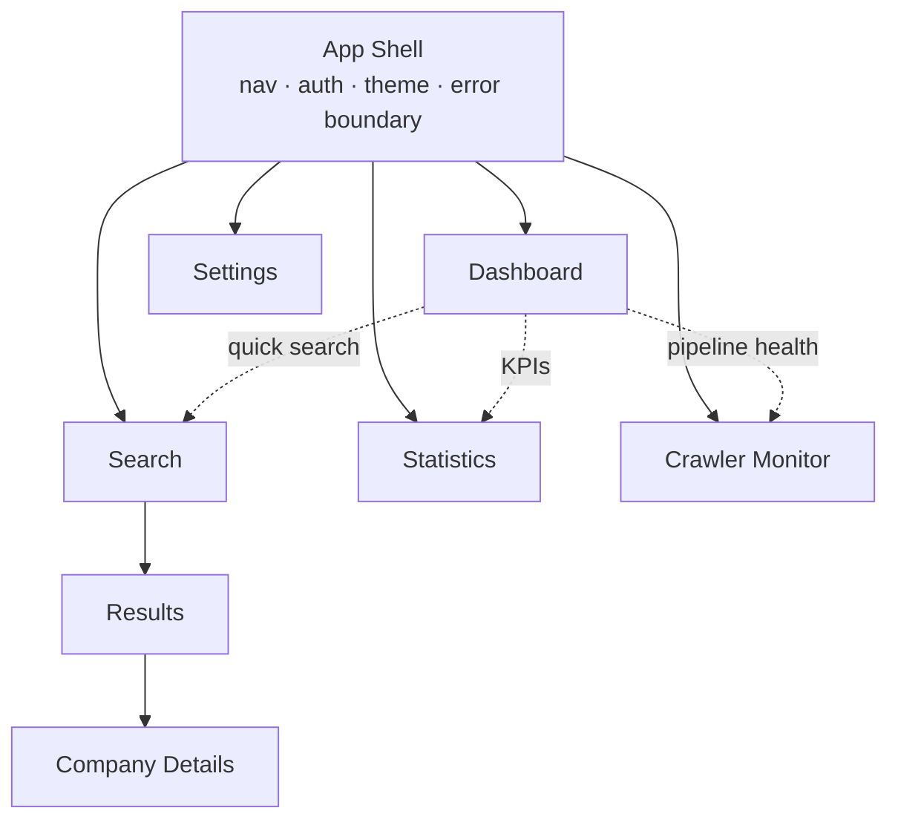
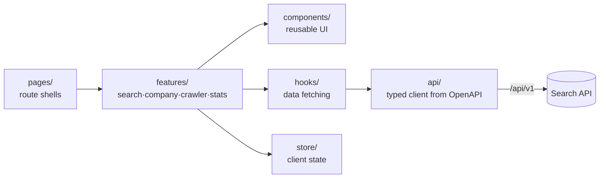

# 8. Frontend Architecture

**Stack:** React + Vite + TypeScript, single-page app talking only to `/api/v1`. The SPA
is a **pure consumer of the Search API** — it holds no business logic, only presentation
and client state. This keeps the boundary clean and lets the API scale independently.

**Organization:** feature-sliced. `pages/` are thin route shells; real work lives in
`features/` (search, company, crawler, stats) so components stay reusable and testable.

## Page hierarchy

## Pages and responsibilities

### Dashboard (`/`)
- **Purpose:** At-a-glance system state and entry point.
- **Shows:** totals (companies, domains, coverage), enrichment funnel, recent discoveries,
  queue health, a prominent search box.
- **Data:** `/stats/overview`, `/stats/pipeline`, `/crawlers/stats`.

### Search (`/search`)
- **Purpose:** Compose a query: free-text box + faceted filter panel (industry, technology,
  location, SEO grade, size, score ranges).
- **Behavior:** builds the `SearchQuery` params (doc 7) and navigates to Results; supports
  type-ahead via `/search/suggest`.

### Results (`/search/results`)
- **Purpose:** Ranked list with live facet sidebar and pagination.
- **Behavior:** filters are URL-encoded (shareable/bookmarkable); selecting a facet
  refines in place; each row links to Company Details.
- **Data:** `/search`, `/search/facets`.

### Company Details (`/companies/:id`)
- **Purpose:** Full 360° profile.
- **Tabs/sections:** Overview, Technologies, SEO, Marketing, Contacts, Locations, Scores,
  Crawl history. A "Re-enrich" action posts to `/companies/{id}/enrich` and shows job status.
- **Data:** `/companies/{id}` and its sub-resources.

### Settings (`/settings`)
- **Purpose:** Adjust non-secret operational config: crawl limits, rate limits, ranking
  weights, discovery sources.
- **Data:** `/settings`, `PUT /settings/{key}`.

### Statistics (`/stats`)
- **Purpose:** Analytical breakdowns: technology adoption, industry distribution,
  geographic spread, pipeline funnel over time.
- **Data:** `/stats/*`. (Charts follow the dataviz guidelines.)

### Crawler Monitor (`/crawlers`)
- **Purpose:** Operational visibility into the async pipeline.
- **Shows:** queue depths per crawler, jobs by status, throughput/error rates, a live job
  timeline; actions to retry failed jobs and launch a discovery run.
- **Data:** `/crawlers/jobs`, `/crawlers/jobs/{id}`, `/crawlers/stats`;
  `POST /crawlers/discovery`, `POST /crawlers/jobs/{id}/retry`.

## Component layers (inside the frontend)

| Layer | Responsibility |
|-------|----------------|
| `pages/` | Route composition only — assemble features, no logic. |
| `features/` | Feature-scoped UI + orchestration (a search flow, a company view). |
| `components/` | Reusable, presentational, prop-driven atoms/molecules. |
| `hooks/` | Data fetching/caching (e.g. query hooks), reused across features. |
| `api/` | **Typed client generated from the API's OpenAPI spec** → compile-time contract safety. |
| `store/` | Client-only state (filters, UI prefs); server state stays in query cache. |
| `types/` | Shared TypeScript types (mirrors API DTOs). |

## Frontend design principles

- **One typed client, generated from OpenAPI** — the frontend can't drift from the API.
- **URL is the state of a search** — filters live in the query string for shareability.
- **No business logic client-side** — grading, scoring, classification are the backend's job.
- **Optimistic-but-honest async UX** — write actions show job status from `202` responses,
  never pretend crawling is instant.
- **Accessibility & theming** — light/dark aware; charts follow the dataviz skill.
