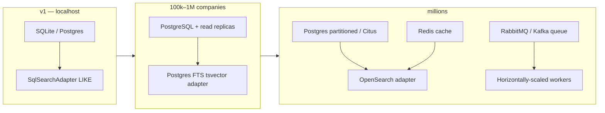

# 11. Optimization & Scale (Phase 9)

> **Principle:** don't optimize prematurely, but don't build in bottlenecks. This
> phase adds only the indexes the *actual* query patterns need, and documents the
> scale path the architecture already anticipated (nothing here required a
> rewrite — that is the whole point of the ports).

## Indexes added this phase

Every index below maps to a real query the code issues today.

| Index | Table (cols) | Query it serves |
|-------|--------------|-----------------|
| `ix_search_industry_score` | `search_documents (industry, seo_score)` | `POST /search` filtering by industry with an SEO-score range/sort |
| `ix_search_grade_score` | `search_documents (seo_grade, seo_score)` | grade filter + score ordering |
| `ix_comptech_tech_company` | `company_technologies (technology_id, company_id)` | "which companies use technology X" (reverse lookup / facet) |
| `ix_crawljobs_status_created` | `crawl_jobs (status, created_at)` | worker queue-picking and the Crawler Monitor list (by status, oldest first) |

Single-column indexes from earlier phases (`industry`, `seo_score`, `status`,
`domain_id`, `company_id`, `technology_id`, the FTS/name columns) remain and
still serve single-facet queries. The composite indexes accelerate the common
*combined* filters without changing any application code.

## Known limitation: text search on the portable adapter

`SqlSearchAdapter` matches free text with `LOWER(col) LIKE '%needle%'`. A leading
wildcard cannot use a b-tree index, so on very large datasets text search is a
scan. This is **deliberate and bounded**:

- For localhost/v1 (up to ~100k companies) it is fine.
- The upgrade is a *new adapter behind the existing `SearchIndexPort`*, already
  proven swappable by the shared contract suite (`tests/contract/`):
  - **PostgreSQL**: a `tsvector` GIN index (and `pg_trgm` for fuzzy name match)
    on the projection — a `PostgresFtsSearchAdapter`.
  - **At search scale**: an `OpenSearchAdapter` streaming `search_documents` into
    an OpenSearch index; native ranking, faceting, and typo tolerance.

No business logic, DTO, API, or frontend code changes for either swap — only the
adapter and one config value (`BISE_SEARCH_BACKEND`).

## Scale path (when the numbers demand it — not before)

**High-volume tables → partitioning candidates.** These grow fastest and are the
first to partition (by time or hash) and, at extreme scale, to distribute via
Citus — none of which touches the domain model:

- `crawled_pages` (one row per fetched page; stores HTML) — partition by
  `fetched_at`; consider offloading raw HTML to object storage, keeping only the
  hash + metadata in the row.
- `company_technologies` — hash-partition by `company_id`.
- `crawl_jobs` / future `logs` — partition by time; archive/prune old rows.

**Caching.** Hot search queries and company profiles are natural Redis targets
(the `SearchIndexPort` and read use cases are the seams). Deferred until a real
hit-rate justifies the invalidation cost.

**Workers.** The queue seam (today: in-process worker over DB-claimed jobs) moves
to RabbitMQ/Kafka with horizontally-scaled crawler workers; jobs are already
claimed from the database, so multi-worker execution is safe once queue-level
locking is added.

## Query hygiene already in place

- **No N+1 on the Company aggregate**: `domains` uses `selectin` loading;
  technology/SEO reads join eagerly.
- **Counts are indexed** (`func.count()` over the filtered set, not row
  materialization) for pagination totals and facets.
- **Facets** are computed with `GROUP BY` (column facets) rather than in Python;
  the technology facet aggregates in Python for now and is the first thing a real
  search engine (OpenSearch) does natively — another reason the port exists.

## What we deliberately did NOT do

- No caching layer yet (no measured hit rate to justify invalidation cost).
- No premature denormalization beyond the single, rebuildable `search_documents`
  projection.
- No switch to a heavier queue/search engine while localhost-scale is the target.

Each of these is a **configuration/adapter change**, not a redesign — the
architecture reserves the seam so the decision can be made on evidence later.
