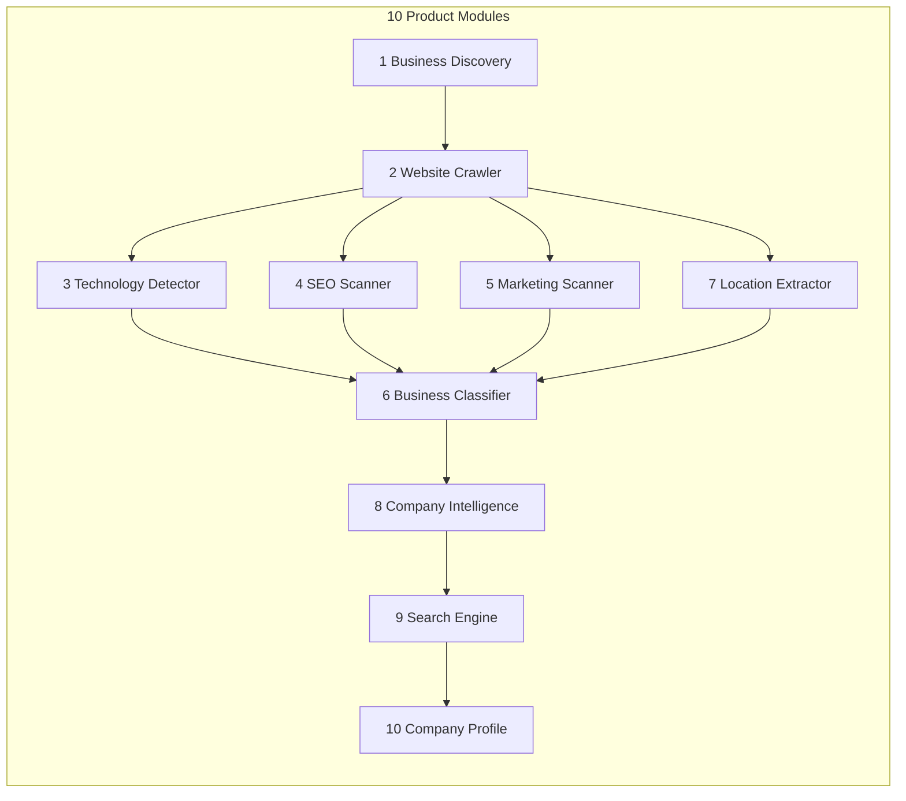
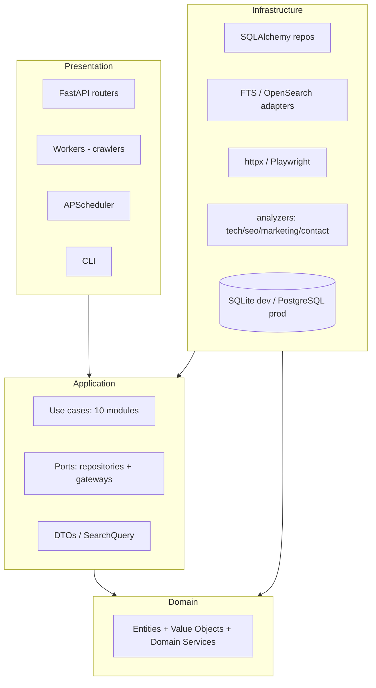
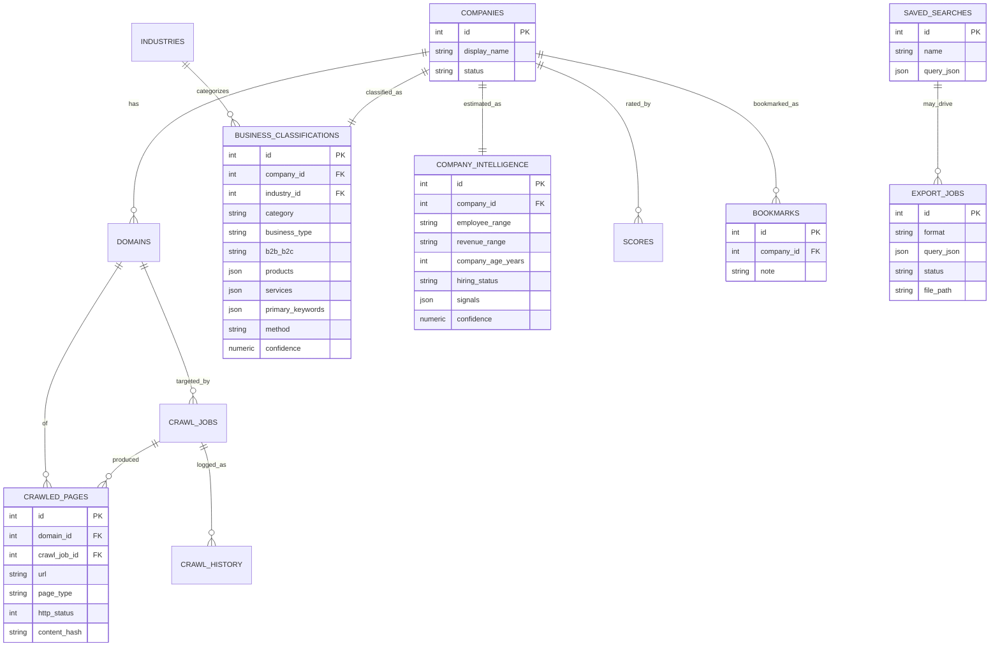
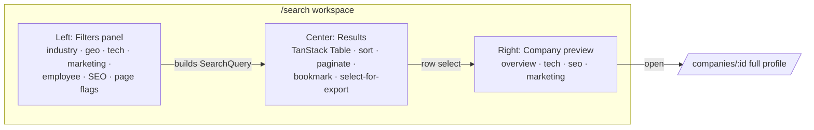

# Phase 1 — Complete System Design (Refined Spec)

> **Status:** Phase 1 — design only. No application code in this phase.
> **Relationship to the dossier:** This document is the **authoritative reconciliation**
> of the refined 10-module spec with the architecture dossier (docs 01–10). Where a topic
> is unchanged, it points to the deeper doc; where the refined spec adds scope, it is
> specified in full here. There is one source of truth, not two.

## What changed vs. the original dossier

The refined spec keeps every architectural principle (Clean Architecture, SOLID, Repository
Pattern, DI, FTS-now/OpenSearch-later, open-source only, no LinkedIn, no paid/AI APIs) and
adds concrete product scope:

| Area | Addition in the refined spec | Where handled |
|------|------------------------------|---------------|
| **Modules** | 10 explicitly named modules incl. **Company Intelligence** (employee/revenue/age/hiring estimation with confidence) | §1, §2 |
| **Classification** | First-class **Business Classification** (industry, category, type, B2B/B2C, products, services, keywords) | §3 tables |
| **Database** | SQLite for dev **and** PostgreSQL for prod behind one config | §3, §6 |
| **Frontend** | Concrete stack: Tailwind, TanStack Table, React Query, React Router; Sales-Navigator 3-pane UX | §5 |
| **Product** | Saved searches, bookmarks, exports (CSV/Excel/JSON), settings persistence | §3 tables, §4 API |
| **MailTester** | Every module replaceable so it can later plug into MailTester | §2 |

Everything else (system diagrams, crawler contracts, coding standards, roadmap) remains as
in [the dossier](./README.md).

---

## §1. The 10 Modules → Clean Architecture mapping

Each module is a **vertical capability** that is independently replaceable. A module is not
a single folder — it is a **domain concept + application use case(s) + infrastructure
adapter(s) + (optionally) a crawler/worker + API surface**. This is what makes a module
swappable: its contract (the port + DTOs) is stable, its implementation is not.



| # | Module | Domain concept | Application port / use case | Infrastructure adapter |
|---|--------|----------------|-----------------------------|------------------------|
| 1 | Business Discovery | `Company`, `Domain` | `DiscoverBusinesses`, `DiscoverySourcePort` | open-registry/OSM/directory adapters |
| 2 | Website Crawler | `CrawlJob`, `WebsiteFeatures` | `CrawlWebsite`, `PageFetcherPort` | httpx / Playwright fetchers, robots |
| 3 | Technology Detector | `Technology`, `CompanyTechnology` | `DetectTechnologies`, `FingerprintPort` | Wappalyzer-rule fingerprinter |
| 4 | SEO Scanner | `SeoProfile` | `RunSeoScan`, `SeoAnalyzerPort`, `PageSpeedPort` | HTML/meta parser, pluggable CWV provider |
| 5 | Marketing Scanner | `MarketingSignal` | `DetectMarketing`, `MarketingAnalyzerPort` | script/pixel/tag detector |
| 6 | Business Classifier | `BusinessClassification` | `ClassifyBusiness`, `ClassifierPort` | rule-based classifier (replaceable) |
| 7 | Location Extractor | `Location`, `CompanyLocation` | `ExtractLocation`, `GeocoderPort` | Nominatim/OSM geocoder |
| 8 | Company Intelligence | `CompanyIntelligence`, `Score` | `EstimateCompanyIntelligence`, `SignalEstimatorPort` | heuristic estimators + confidence |
| 9 | Search Engine | `SearchQuery`, `SearchResult` | `SearchCompanies`, `SearchIndexPort` | Postgres FTS → OpenSearch adapter |
| 10 | Company Profile | aggregate read model | `GetCompanyProfile` | read repositories |

**Replaceability guarantee:** every module's port has a **contract test suite** (see doc 9
/ roadmap M14). Any new implementation (e.g. an ML classifier replacing the rule-based one,
or MailTester's own crawler) must pass the same suite — so it drops in without touching
business logic.

**Module 6 (Classifier) explicitly rule-based first.** It implements `ClassifierPort`. A
future ML/AI classifier is a *different adapter* behind the same port — no domain change,
and no paid AI dependency now or ever required.

**Module 8 (Company Intelligence)** derives estimates (employee range, revenue range,
company age, hiring status) from public signals (page volume, careers-page job counts,
copyright/`whois`-style public age hints, tech footprint). Every estimate is stored **with a
`confidence` score and its evidence** — never presented as fact.

---

## §2. Clean Architecture layout (four layers) + MailTester readiness

Unchanged in principle from [doc 02](./02-clean-architecture.md); the **Dependency Rule**
holds: `presentation → infrastructure → application → domain`, and Domain imports no
framework. The refinement is only that the module count grows to 10 — each still lands in
the same four layers.



**MailTester integration path:** because Domain + Application are framework-free and every
capability is a port, MailTester can later:
- import `bise.domain` + `bise.application` as a library, or
- call the REST API, or
- reuse a single module (e.g. Technology Detector) by depending only on its port.

No refactor is required — that is the point of the module contracts.

---

## §3. Database Design (normalized, SQLite dev / PostgreSQL prod)

Builds on [doc 04](./04-database-design.md) and **adds** the tables the refined spec
requires. Design rules unchanged: 3NF, surrogate keys, `created_at`/`updated_at`,
append-only history, one denormalized `search_documents` read projection.

### Portability: SQLite ↔ PostgreSQL

One `DatabasePort` / SQLAlchemy engine chosen by `BISE_DB_URL`. To stay portable:
- Use SQLAlchemy types that map to both (`JSON` not `JSONB` in the model; the Postgres
  dialect renders `JSONB`, SQLite renders `JSON`/`TEXT`).
- Full-text search abstracted behind `SearchIndexPort`: SQLite dev uses `LIKE`/`FTS5`, prod
  uses Postgres `tsvector`. **Business logic never sees the difference** (doc 05).
- Migrations via Alembic run on both; avoid Postgres-only DDL in shared migrations
  (partitioning, `tsvector` GIN) — those live in Postgres-guarded migration branches.

### Full table catalog

Core (from doc 04): `companies`, `domains`, `technology_categories`, `technologies`,
`company_technologies`, `website_features`, `seo_profiles`, `marketing_signals`,
`contacts`, `industries`, `locations`, `company_locations`, `scores`, `crawl_jobs`,
`crawl_history`, `logs`, `search_documents`, `settings`.

**Added for the refined spec:**

| Table | Grain | Key columns |
|-------|-------|-------------|
| `business_classifications` | 1 per company (current) | company_id FK, industry_id FK, category, business_type, b2b_b2c, products (json), services (json), primary_keywords (json), method, confidence, classified_at |
| `company_intelligence` | 1 per company (current) | company_id FK, employee_range, revenue_range, company_age_years, hiring_status, signals (json), confidence, estimated_at |
| `crawled_pages` | 1 per fetched page | domain_id FK, crawl_job_id FK, url, page_type (home/about/contact/blog/careers/privacy/terms/other), http_status, content_hash, fetched_at |
| `saved_searches` | 1 per saved filter set | name, query_json, created_at |
| `bookmarks` | 1 per bookmarked company | company_id FK, note, created_at |
| `export_jobs` | 1 per export request | format (csv/xlsx/json), query_json, status, file_path, created_at |

Notes:
- `business_classifications` is separated from `companies` because it is derived, versioned,
  and method-tagged (rule-based now, ML later) with its own confidence — it must not
  pollute the core entity.
- `company_intelligence` is separate for the same reason: derived estimates with confidence,
  refreshed independently of the company record.
- `crawled_pages` records exactly which pages were downloaded (spec Module 2/10 "Pages
  Crawled") and their type, enabling "Has Contact Page / Careers Page" filters directly.

### ER diagram (additions + their relationships)



The **core ER diagram** (companies/domains/technologies/seo/marketing/contacts/locations/
scores/crawl) is in [doc 04](./04-database-design.md) and is unchanged.

---

## §4. API Architecture (design only)

Builds on [doc 07](./07-api-architecture.md); here is the endpoint set aligned to the
refined spec's examples. All under `/api/v1`, JSON, paginated, RFC7807 errors,
correlation ids. Write endpoints that trigger crawling return `202 Accepted` + a job handle.

| Method | Path | Purpose |
|--------|------|---------|
| POST | `/search` | Faceted multi-filter search (the Sales-Navigator query) |
| GET | `/companies` | List/browse companies (paginated) |
| GET | `/companies/{id}` | Full company profile (Module 10) |
| POST | `/crawl` | Enqueue a crawl/enrichment run → 202 |
| GET | `/technologies` | Facet source: known technologies |
| GET | `/industries` | Facet source: industry taxonomy |
| GET | `/countries` · `/states` · `/cities` | Location facet sources (cascading) |
| GET | `/statistics` | Dashboard KPIs + pipeline funnel |
| GET/POST/DELETE | `/saved-searches` | Manage saved filter sets |
| GET/POST/DELETE | `/bookmarks` | Manage bookmarked companies |
| POST | `/exports` | Create CSV/Excel/JSON export → 202 + status_url |
| GET | `/exports/{id}` | Poll export status / download link |
| GET | `/crawlers/jobs` · `/crawlers/jobs/{id}` | Crawler Status page |
| GET/PUT | `/settings` | Read/update crawler + system settings |
| GET | `/health` · `/health/ready` | Liveness / readiness |

**`POST /search` request body (the worked example from the spec):**
```json
{
  "text": "dentist",
  "filters": {
    "industry": ["Dentistry"],
    "country": ["Australia"], "state": ["NSW"], "city": ["Sydney"],
    "technology": ["WordPress"],
    "marketing": ["Google Ads", "Meta Pixel"],
    "employee_range": ["10-50"],
    "has_contact_page": true,
    "has_careers_page": true,
    "seo_score": { "lt": 50 }
  },
  "sort": "relevance",
  "page": 1, "page_size": 25,
  "facets": ["industry", "technology", "marketing", "country", "seo_grade"]
}
```
Response mirrors doc 07's `SearchResult` (items + facets + total). Full request/response
conventions (auth-later, pagination, error envelope) are in [doc 07](./07-api-architecture.md).

**Documentation:** FastAPI auto-generates OpenAPI; each endpoint carries a summary,
parameter docs, and example payloads → satisfies "every API must be documented".

---

## §5. Frontend Architecture (refined stack + Sales-Navigator UX)

Refines [doc 08](./08-frontend-architecture.md) with the concrete stack and 3-pane layout.

**Stack:** React + Vite + TypeScript + **Tailwind CSS** (styling/dark mode),
**TanStack Table** (results grid: sorting, column control, virtualization),
**React Query** (server state/caching), **React Router** (routing). Typed API client is
generated from the backend OpenAPI spec.

**Sales-Navigator 3-pane Search workspace:**



**Pages:** Dashboard · Search (3-pane) · Company Details · Crawler Status · Statistics ·
Settings. **Global:** dark mode, responsive, professional UI. **Product features:** saved
searches, bookmarks, CSV/Excel/JSON export from the current result set.

Component layering (pages → features → components → hooks → api client → store) is unchanged
from doc 08. No business logic client-side — grading/scoring/classification stay server-side.

---

## §6. Clean Architecture layout — updated folder structure

Extends [doc 03](./03-folder-structure.md). Only the **deltas** for the refined spec are
shown; everything else is as in doc 03 and already scaffolded in Milestone 1.

```
src/bise/
  domain/
    entities/
      + business_classification.py   # Module 6 entity
      + company_intelligence.py      # Module 8 entity
      + crawled_page.py              # Module 2/10 page record
    services/
      + classification_rules.py      # rule-based classifier logic (pure)
      + intelligence_estimators.py   # employee/revenue/age heuristics (pure)
  application/
    ports/
      + classifier.py                # ClassifierPort (replaceable → ML later)
      + geocoder.py                  # GeocoderPort
      + page_speed.py                # PageSpeedPort (pluggable CWV)
      + exporter.py                  # ExporterPort (csv/xlsx/json)
    use_cases/
      classification/                # ClassifyBusiness
      intelligence/                  # EstimateCompanyIntelligence
      exports/                       # CreateExport
      saved_searches/                # CRUD use cases
      bookmarks/                     # CRUD use cases
  infrastructure/
    classifier/
      + rule_based_classifier.py     # implements ClassifierPort
    geocoding/
      + nominatim_geocoder.py        # implements GeocoderPort
    pagespeed/
      + pluggable_cwv.py             # implements PageSpeedPort (no paid API required)
    export/
      + csv_exporter.py  + xlsx_exporter.py  + json_exporter.py
    db/
      + sqlite / postgres engine selection via DB_URL (one place)
  crawlers/
    + intelligence_crawler.py        # Module 8 worker (post-enrichment)
frontend/
    src/features/
      + saved-searches/  + bookmarks/  + exports/
```

**Why these additions exist:**
- `domain/services/classification_rules.py` & `intelligence_estimators.py` — pure,
  table-driven logic → unit-testable in milliseconds, safe to evolve, no framework.
- `application/ports/classifier.py` & `exporter.py` & `geocoder.py` & `page_speed.py` —
  the replaceability seams the spec demands (rule-based→ML classifier, pluggable CWV, etc.).
- `infrastructure/export/` split by format — one exporter class per format (SRP), all
  behind `ExporterPort`.
- `infrastructure/pagespeed/pluggable_cwv.py` — Core Web Vitals behind a port so we can use
  a free/local provider now and swap later **without a paid PageSpeed dependency**.
- `crawlers/intelligence_crawler.py` — Module 8 runs after tech/seo/marketing/location have
  populated signals, then writes `company_intelligence` with confidence.

---

## §7. What Phase 1 does NOT include (guardrails)

- **No application code** — this phase is design. Backend build is Phase 2.
- **No future modules** — Email Finder, verification, decision-maker discovery, Chrome
  extension, auth, multi-tenancy, billing, AI recommendations, CRM, campaigns are
  explicitly out of scope now, but the module/port design leaves clean seams for each.

---

## Phase 1 deliverables checklist

- [x] Complete folder structure + rationale (doc 03 + §6 deltas)
- [x] Database schema, normalized, SQLite+Postgres (doc 04 + §3 additions)
- [x] ER diagrams in Mermaid (doc 04 core + §3 additions)
- [x] API architecture (doc 07 + §4 endpoint set)
- [x] Clean Architecture layout + 10-module mapping (doc 02 + §1–§2)

**Phase 1 complete. Awaiting approval to begin Phase 2 (backend build).**
